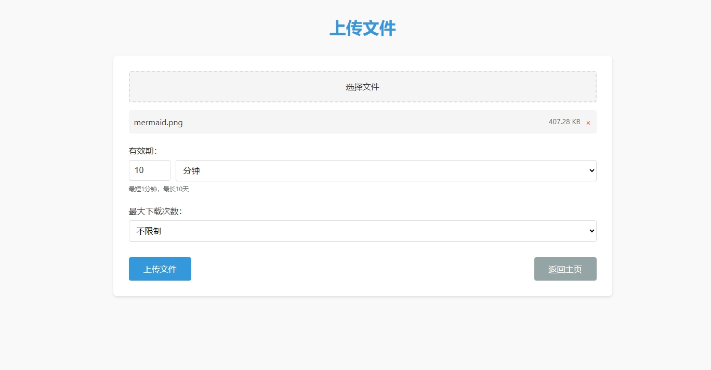

# 文件共享平台

这是一个基于Flask的简易文件共享平台，支持文件上传、取件和管理功能。采用类似快递柜的取件码机制，让文件分享变得简单高效。


## 主要功能

- 无需登录注册，采用取件码方式共享文件
- 上传多个文件，生成随机取件码
- 通过取件码下载文件
- 支持断点续传和恢复下载
- 高级文件安全检查与病毒防护
- 支持设置有效期和下载次数限制
- 简洁现代的用户界面
- 实时刷新的管理界面查看下载情况
- 支持保留原始文件名（包括非拉丁字符）
- 自动清理过期文件

## 技术栈

- 后端：Python + Flask
- 前端：HTML + CSS + JavaScript
- 数据存储：JSON文件（无需数据库）

## 安装与运行

### 安装依赖

```bash
pip install -r requirements.txt
```

### 运行应用

使用提供的批处理脚本启动应用：

```bash
start.bat
```

或者直接运行Python脚本：

```bash
python app.py
```

应用将在 http://localhost:5000 运行。

### 启动选项

启动应用时可以使用以下选项：

```bash
# 启动时清理所有文件
start.bat --clean

# 退出时清理所有文件
start.bat --clean-on-exit

# 显示帮助信息
start.bat --help
```

## 配置系统

配置文件保存在`config.json`中，包括以下主要配置项：

- `server`: 服务器设置（主机、端口、调试模式）
- `file_limits`: 文件限制（大小、数量、总存储容量）
- `time_limits`: 时间限制（过期时间设置）
- `pickup_code`: 取件码配置
- `security`: 安全设置（允许的文件类型、禁止的文件类型）

## 使用方法

1. 访问主页，选择"上传文件"
2. 选择需要上传的文件，设置有效期和下载次数
3. 上传完成后获取取件码和管理链接
4. 将取件码发送给需要获取文件的人
5. 收件人输入取件码即可下载文件
6. 上传者可通过管理链接查看下载情况或删除文件




## 内网穿透与远程访问

本项目默认只能在局域网内访问。如需从外部访问，推荐以下两种方式：

### 1. 使用VS Code的端口转发功能（推荐）

如果您使用VS Code开发，可以利用其内置的端口转发功能，无需额外配置：

1. 在VS Code中打开命令面板（Ctrl+Shift+P）
2. 输入 "Forward a Port" 并选择
3. 输入端口 5000
4. VS Code将提供一个公共URL，可以从任何地方访问您的应用

这种方式简单、安全，非常适合临时使用场景。

### 2. 使用专业内网穿透工具

对于长期或生产环境使用，可以考虑以下工具：
- frp
- ngrok
- natapp
- 花生壳

## 高级功能

### 管理界面实时刷新

管理界面新增自动刷新功能，可以：
- 自动每30秒更新一次下载记录
- 手动点击刷新按钮立即获取最新数据
- 显示上次刷新时间，便于了解数据新鲜度


### 原始文件名保留

现在系统支持上传和下载包含非拉丁字符的文件名：
- 保存文件时使用安全文件名
- 下载文件时还原为原始文件名
- 解决中文、日文、韩文等特殊字符文件名问题

### 增强的文件安全检查

系统现在会执行以下安全检查：
- 检查文件扩展名是否在禁止列表中
- 检查文件名中隐藏的多个扩展名（如 file.php.jpg）
- 分析图片文件头部内容是否包含PHP代码
- 检查ZIP文件内部是否包含禁止类型的文件

### 关闭选项

添加了关闭时的数据处理选项：
- `--clean-on-exit` 参数在服务关闭时清理所有文件
- `--clean` 参数在启动时清理所有文件
- 默认模式保留所有文件数据

## 致谢与灵感来源

本项目的创意部分受到 [FilePizza](https://github.com/kern/filepizza) 项目的启发，但在实现方式上有很大不同：

- FilePizza 使用 WebTorrent 和 WebRTC 进行点对点传输，而本项目采用传统的客户端-服务器模型
- FilePizza 在国内网络环境下可能存在连接问题，而本项目可以在内网或通过内网穿透稳定运行
- FilePizza 侧重简单的一对一传输，本项目增加了批量处理、生命周期管理等功能
- 本项目增加了文件管理后台，便于上传者了解文件被下载情况

感谢 FilePizza 项目带来的灵感，同时也感谢所有开源社区的贡献者。

## 作者

[Quietpeng](https://github.com/Quietpeng)

## 许可证

MIT
